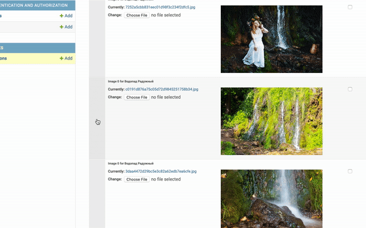

## Проект «Куда пойти — Москва глазами Артёма»    

### Общая информация   
Проект доступен по ссылке: https://kudago.pythonanywhere.com  
Панель администратора: https://kudago.pythonanywhere.com/admin

Это код первого урока в курсе по Python и веб-разработке на сайте [Devman](https://dvmn.org)

Тестовые данные взяты с сайта [KudaGo](https://kudago.com/).

### Инструкция по локальному запуску (для разработчика)   
1. Скачать репозиторий: 
   ```
   git clone https://github.com/MargaritaPopova/where_to_go.git
   ```
2. Перейти в папку проекта:
   ```
   cd where_to_go
   ```
3. Создать и активировать виртуальное окружение удобным для вас способом:
   ```
   # например, через virtualenv
   python3 -m venv <your-venv-name>
   
   source <your-venv-name>/bin/activate
   ```
4. Установить зависимости:
   ```
   pip install -r requirements.txt
   ```
5. Запустить миграции:
    ```
   python manage.py migrate
   ```
6. Запустить сервер:
    ```
   python manage.py runserver
   ```
7. Сайт запущен на локалхосте по адресу http://127.0.0.1:8000. Теперь можно создать суперюзера...
    ```
   python manage.py createsuperuser
   ```
   ...и зайти в админку по адресу: http://127.0.0.1:8000/admin/
8. Пока на сайте нет локаций. Чтобы поместить локацию на карту, запустите скрипт cо ссылкой на файл локации:
    ```
   python manage.py load_place <link>
   ```
   Ссылки можно взять [тут](links.txt).   
   Либо добавьте локации вручную через админ-панель. 

### Создание/редактирование локации в админ-панели   

1. Перейдите в админ-панель по адресу: https://kudago.pythonanywhere.com/admin или http://127.0.0.1:8000/admin/ и введите логин и пароль.

1. Для создания локации нажмите кнопку ```Add``` в панели слева:
 
2. Для редактирования локаций откройте их список Locations и выберите нужную, кликнув на нее в списке справа. 
2. Заполните форму и загрузите картинки. Порядок загруженных картинок можно менять перетаскиванием:   

3. Не забудьте нажать ```SAVE```!

